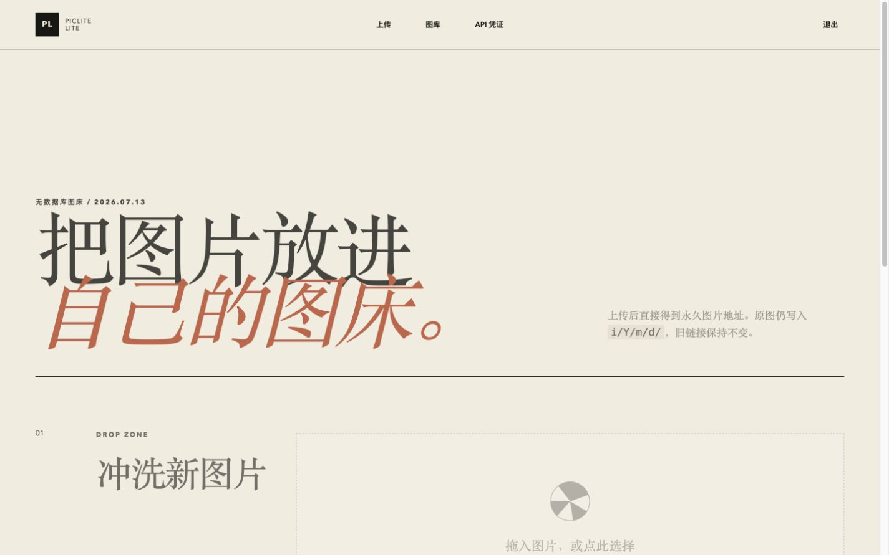
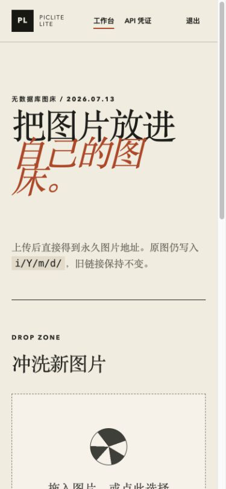
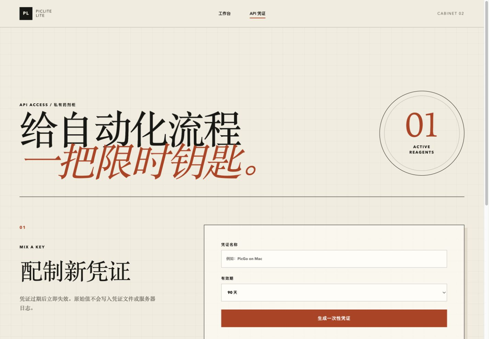

# PicLite

[](https://www.php.net/)
[](https://github.com/Lau0x/piclite/releases)
[](https://github.com/Lau0x/piclite/pkgs/container/piclite)
[](https://github.com/Lau0x/piclite/blob/main/LICENSE)

PicLite 是一个轻量、无数据库的自托管图床。图片、配置和日志都保存在文件系统中，适合个人、团队内网和小型公开站点。

项目基于 [EasyImages2.0](https://github.com/icret/EasyImages2.0) 继续维护，保留 `/i/Y/m/d/` 图片路径兼容性，并提供更简单的 Lite 工作台、Docker 镜像和自动发布流程。



## Lite 模式

Lite 是推荐给新部署的简单模式：管理员登录、多图上传、按上海自然日浏览、图片删除和可吊销的 API 凭证。它不会使用数据库，也不会改写已有 `/i/` 图片路径。





需要水印、压缩、远程下载、统计等完整功能时，仍可使用保留的 Classic 模式。

## Docker 快速开始

```sh
git clone https://github.com/Lau0x/piclite.git
cd piclite
cp .env.example .env
docker compose pull
docker compose up -d
```

打开 `http://localhost:8080/lite/`。首次访问会进入初始化页面，再从容器日志中取得 30 分钟有效的初始化凭证：

```sh
docker compose logs piclite | grep 'PicLite Lite setup token'
```

默认镜像为 `ghcr.io/lau0x/piclite:latest`，支持 `linux/amd64` 和 `linux/arm64`。数据保存在三个挂载目录中：

- `i/`：原图与缓存，旧图片直链继续有效
- `config/`：Classic 配置和 Lite 的本地安全状态
- `admin/logs/`：运行日志

生产环境请在 `.env` 中设置真实 `LITE_BASE_URL`。希望 Lite 直接占用域名根路径时，把 `LITE_APP_PATH` 改为 `/`。

## 文档

- [Lite 模式](docs/Lite模式.md)
- [从 EasyImages2.0 迁移与回退](docs/从EasyImages2.0迁移.md)
- [Classic 安装](docs/安装图床.md)
- [安全配置](docs/安全配置.md)
- [Classic API](docs/API.md)

## Docker 镜像发布

推送到 `main` 后，GitHub Actions 会在测试通过后构建 `linux/amd64`、`linux/arm64` 镜像，并发布 `latest` 和短提交标签；发布 GitHub Release 时会额外生成对应版本标签。

## 开源许可

PicLite 使用 [GPL-2.0](LICENSE)，感谢 EasyImages2.0 原作者 [Icret](https://github.com/icret) 和上游贡献者。
