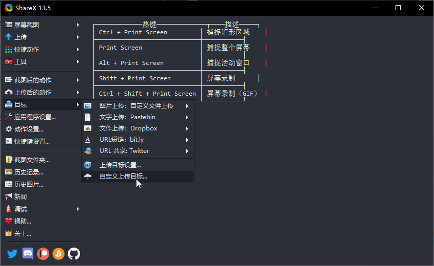
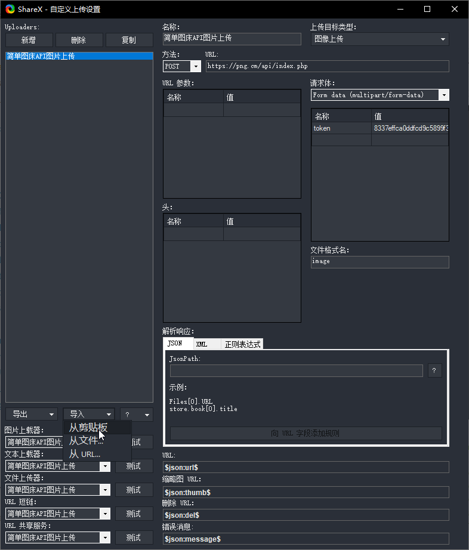
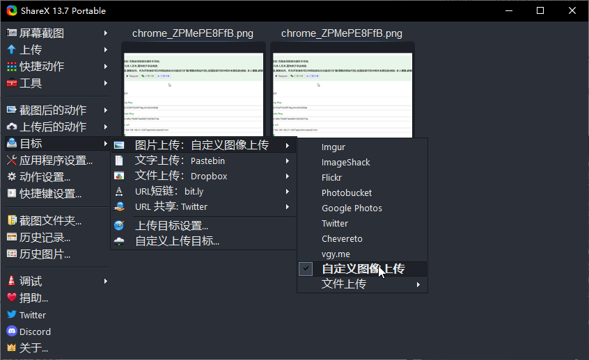

- 登录图床后台->图床安全->高级设置->开启API上传
- 下载[ShareX](https://getsharex.com/downloads/)，然后打开目标->自定义上传目标->导入下面代码即可上传。


  
- 需要注意，`RequestURL`需要替换成自己的域名，token也需要修改成自己的！

```ShareX
{
  "Version": "15.0.0",
  "Name": "PicLite API 图片上传",
  "DestinationType": "ImageUploader",
  "RequestMethod": "POST",
  "RequestURL": "https://example.com/api/index.php",
  "Body": "MultipartFormData",
  "Arguments": {
    "token": "YOUR_API_TOKEN"
  },
  "FileFormName": "image",
  "URL": "{json:url}",
  "ThumbnailURL": "{json:thumb}",
  "DeletionURL": "{json:del}",
  "ErrorMessage": "{json:message}"
}
```


- 上边设置好以后 设置为默认上传


